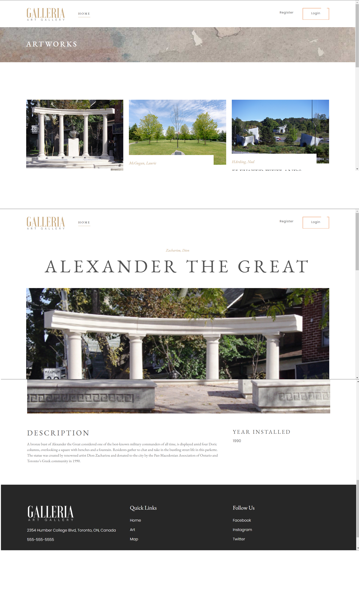
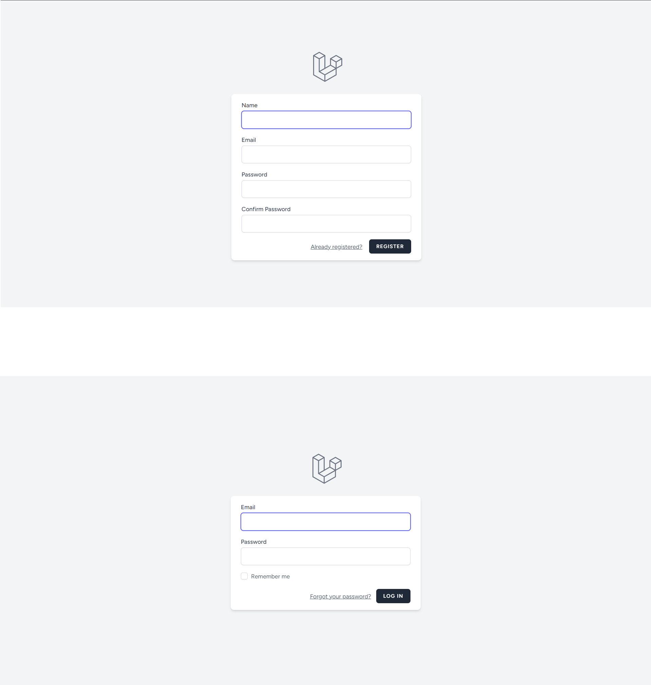
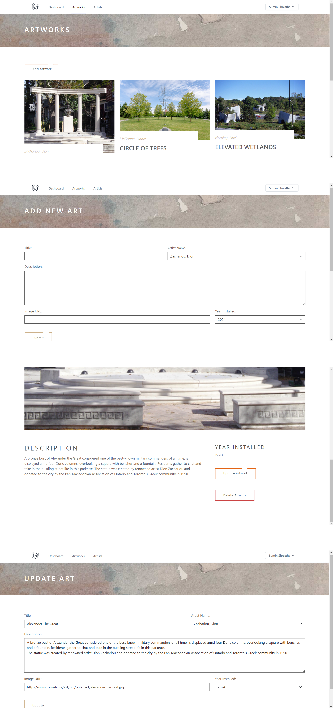
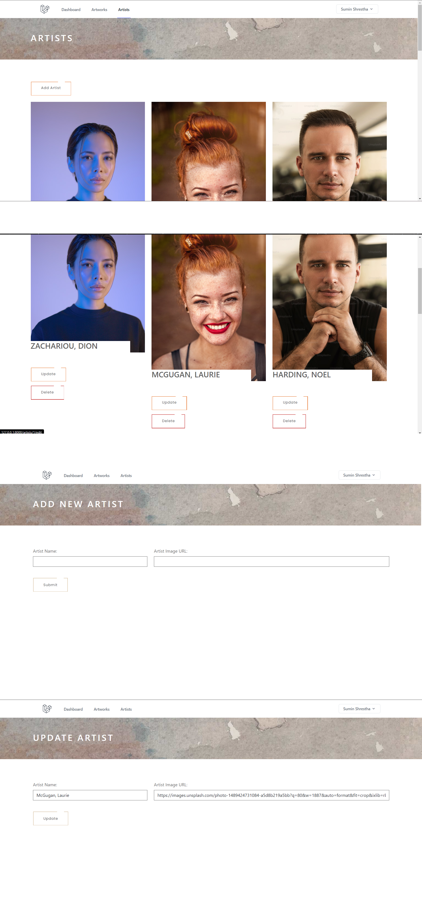

# Public Art Management System with Laravel

## Project Description

The Public Art Management System is a web application designed to manage public art installations. It provides an admin dashboard for managing artworks and artists, including CRUD (Create, Read, Update, Delete) operations. The application uses Bootstrap for responsiveness and custom CSS for styling.

## Technologies Used

`Laravel`, `PHP`, `MySQL`, `HTML`, `CSS`, `Bootstrap`, `JavaScript`

## Features
- CRUD Operations: Create, Read, Update, and Delete `artworks`.
- CRUD Operations: Create, Read, Update, and Delete `artists`.
- CREATE method of `artworks` saves relationship to `artists` table by `artist_id` which is the foreign_key for `artists` table).
- Authentication using Breeze with registration and login functionality.
- Admin Dashboard: Dedicated admin panel for data management.
- Public views: login and register views, the welcome page with all the artworks and the page displaying artwork by `id`.
- Admin views: dashboard, artworks (create, edit, index, show) and artists (create, edit and index)

## Database Design

The database consists of three tables: artworks, artists, and users. The artworks table has a foreign key `artistId` that references the `id` in the artists table (one-to-many relationship where one artist can have multiple artworks).

### Artworks Table:
- `_id`: Primary key, auto-incremented `integer` (20).
- `title`: Title of the artwork, `varchar`(255).
- `imageURL`: URL of the image, `varchar`(255).
- `yearInstalled`: Year the artwork was installed, `varchar`(11).
- `description`: Description of the artwork, `text`.
- `artistId`: Foreign key, references artistId in artists table, `int` (20).

### Artists Table:
- `id`: Primary key, auto-incremented `integer` (20).
- `artistImage`: Image URL of the artist, `varchar`(255).
- `artist`: Name of the artist, `varchar`(255).

## Public Views

## Login/Register Views

## Admin Views

### Manage Artworks

### Manage Artists

